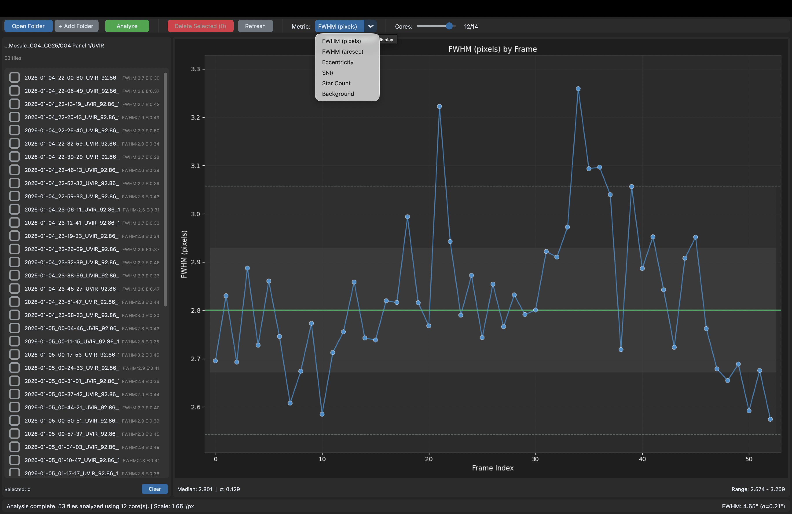

# SubFrame Selector

A desktop application for astrophotographers to analyze and reject bad subframes based on quality metrics. Inspired by PixInsight's SubframeSelector.

## Download

**No installation required!** Download the latest release for your platform:

| Platform | Download |
|----------|----------|
| **macOS** | [SubFrameSelector-macOS.zip](https://github.com/HiranD/Sub-Frame-Selector/releases/latest) |
| **Windows** | [SubFrameSelector-Windows.zip](https://github.com/HiranD/Sub-Frame-Selector/releases/latest) |

### Quick Start (macOS)
1. Download `SubFrameSelector-macOS.zip` from [Releases](https://github.com/HiranD/Sub-Frame-Selector/releases/latest)
2. Extract the zip file
3. Right-click `SubFrame Selector.app` → Open (first time only, to bypass Gatekeeper)
4. Load your FITS folder and start analyzing!

### Quick Start (Windows)
1. Download `SubFrameSelector-Windows.zip` from [Releases](https://github.com/HiranD/Sub-Frame-Selector/releases/latest)
2. Extract the zip file
3. Run `SubFrame Selector.exe`
4. Load your FITS folder and start analyzing!

## Screenshot



## Features

- **Load FITS files** from one or multiple folders
- **Parallel analysis** using configurable CPU cores
- **Quality metrics**:
  - FWHM (star sharpness) - in pixels or arcseconds
  - Eccentricity (star roundness)
  - SNR (signal-to-noise ratio)
  - Star Count
  - Background level
- **Interactive plot** with sigma bands for outlier detection
- **Click-to-select** bad frames on the plot or file list
- **Cached results** so re-opening an analyzed folder is instant
- **Refresh** to rescan folders after deletion (uses cached data)
- **Safe deletion** to Recycle Bin (recoverable)
- **Tooltips** on all controls for easy learning

## How to Use

1. **Open Folder** - Select a folder containing FITS files
2. **+ Add Folder** - Optionally add more folders to analyze together
3. **Analyze** - Calculate quality metrics for all frames (adjust CPU cores as needed)
4. **Select Metric** - Choose which metric to display (FWHM, Eccentricity, etc.)
5. **Identify Outliers** - Points outside the gray sigma bands are potential bad frames
6. **Click to Select** - Click points on the plot or checkboxes in the file list
7. **Delete Selected** - Move bad frames to Recycle Bin
8. **Refresh** - Rescan folders and update plots with remaining files

## Cached Analysis

Analysing a frame is expensive, so the result is saved next to it:

```
M31_L_120s_0001.fits          <- your frame
M31_L_120s_0001.fits.sfs.json <- its cached analysis (~25 KB)
```

Re-opening a folder you've already analyzed shows its metrics immediately, with
no need to press **Analyze** again. A frame is re-analyzed automatically if it
changes, or if you change the detection settings. Tick **Force** next to
Analyze to recompute everything regardless.

Deleting a frame sends its sidecar to the Recycle Bin too, so nothing is left
orphaned.

Sidecars also hold the full per-star measurements (position, FWHM in x and y,
amplitude), which the app itself only uses in aggregate. That makes them useful
on their own — for tilt and field-curvature maps, seeing trends across a
session, or feeding a frame ranking into other software:

```python
import json, pandas as pd
from pathlib import Path

frames = [json.load(open(p)) for p in Path("lights").rglob("*.sfs.json")]
df = pd.json_normalize(frames)                 # one row per frame
stars = pd.DataFrame(frames[0]["stars"])       # per-star table for one frame
```

If you don't want them, deleting the `.sfs.json` files is harmless — the app
just re-analyzes next time.

## Understanding the Plot

### Sigma Bands
The plot shows statistical boundaries using Median Absolute Deviation (MAD):
- **Green line**: Median value
- **Dark gray band**: ±1σ from median (~68% of frames)
- **Light gray band**: ±2σ from median (~95% of frames)
- **Outside bands**: Statistical outliers - candidates for rejection

### Quality Metrics

| Metric | Good Value | Bad Value | What It Indicates |
|--------|------------|-----------|-------------------|
| **FWHM** | Low | High | Focus quality / atmospheric seeing |
| **Eccentricity** | < 0.5 | > 0.6 | Tracking/guiding errors (elongated stars) |
| **SNR** | High | Low | Image noise level |
| **Star Count** | Consistent | Drops | Clouds, fog, or obstructions |
| **Background** | Low & stable | High/variable | Moonlight, twilight, light pollution |

## FITS Header Support

The app reads camera/telescope metadata from FITS headers to calculate FWHM in arcseconds:
- **Pixel Size**: `XPIXSZ`, `PIXSIZE`
- **Focal Length**: `FOCALLEN`, `FOCAL`
- **Binning**: `XBINNING`, `BINNING`

Image scale formula: `(pixel_size_μm × binning / focal_length_mm) × 206.265 arcsec/pixel`

Scale is read per frame, so loading folders shot with different telescopes or
cameras gives each frame its own correct arcsecond values. When a set spans
more than one scale, the status bar reports the range instead of a single figure.

---

## For Developers

### Running from Source

```bash
# Clone the repository
git clone https://github.com/HiranD/Sub-Frame-Selector.git
cd Sub-Frame-Selector

# Install dependencies
pip install -r requirements.txt

# Run the application
python run.py
```

### Requirements
- Python 3.10+
- customtkinter
- matplotlib
- astropy
- photutils
- numpy
- scipy
- send2trash

### Building Standalone App

```bash
# Install PyInstaller
pip install pyinstaller

# Build (creates dist/SubFrame Selector.app on macOS)
pyinstaller subframe-selector.spec --clean -y
```

### Project Structure

```
sub-frame-selector/
├── src/
│   ├── analysis/       # Core analysis engine
│   │   ├── analyzer.py     # Parallel processing orchestrator
│   │   ├── fits_reader.py  # FITS file I/O
│   │   ├── star_detector.py # Star detection & PSF fitting
│   │   ├── metrics.py      # Quality metrics calculation
│   │   └── statistics.py   # MAD-based sigma bands
│   └── gui/            # User interface
│       ├── app.py          # Main application window
│       ├── toolbar.py      # Buttons and controls
│       ├── file_panel.py   # File list with checkboxes
│       └── plot_panel.py   # Interactive matplotlib plot
├── run.py              # Entry point
├── requirements.txt
└── subframe-selector.spec  # PyInstaller config
```

## License

[MIT](LICENSE)
